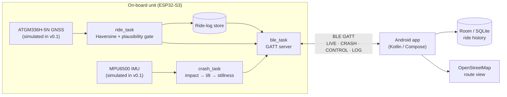

# SmartRide

**Two-wheeler ride logger and crash detection system using the ESP32-S3.**
B.Tech CSE Project, Group 14 — TKM Institute of Technology, Kollam (APJ Abdul Kalam Technological University).

A compact on-board unit reads position, speed and motion, computes ride statistics and
evaluates a multi-condition crash rule (impact → sustained tilt → stillness) **on the
microcontroller itself**. It delivers live data, crash alerts and stored ride logs to the
rider's Android phone over Bluetooth Low Energy. No cellular modem, cloud account or
network is needed.



## Repository

| Path | What |
|---|---|
| [`firmware/`](firmware/) | ESP32-S3 firmware (PlatformIO, Arduino + NimBLE). See [firmware/README.md](firmware/README.md) |
| [`android/`](android/) | Android app (Kotlin, Jetpack Compose, Room) |
| [`docs/ble-protocol.md`](docs/ble-protocol.md) | The BLE contract between the unit and the app |
| [`docs/progress.md`](docs/progress.md) | What is implemented, what is simulated, what is next |
| [`docs/report/`](docs/report/) | Phase 1 report and presentation |
| [`tools/`](tools/) | `ble_client.py` (protocol test client), `gen_sim_route.py` (simulated GNSS route), `check-clean.ps1` |

## Quick start

**Firmware** (needs PlatformIO and an ESP32-S3 on USB):
```bash
cd firmware
pio run -t upload -t monitor     # flash and open the serial console, then press h for commands
pio test -e esp32-s3             # run the unit tests on the board
```

**Talk to it from a laptop** (Windows, Linux or macOS with Bluetooth):
```bash
python -m venv tools/.venv
tools/.venv/Scripts/pip install -r tools/requirements.txt
tools/.venv/Scripts/python tools/ble_client.py logs      # sync and CRC-verify all ride logs
```

**Android app:** open `android/` in Android Studio and run on a phone with Bluetooth on.

## Status (v0.1)

The BLE protocol, ride statistics, crash state machine and ride-log transfer are implemented,
unit-tested and running on the ESP32-S3. GNSS and IMU input are **simulated** along a real road
route near the college until the sensors are fitted. Full table: [docs/progress.md](docs/progress.md).

## Team

Adarsh Raj · Muhammed Afsal · Irfan V · Rojith Ram
Guide: Mrs. Neetha Alex
